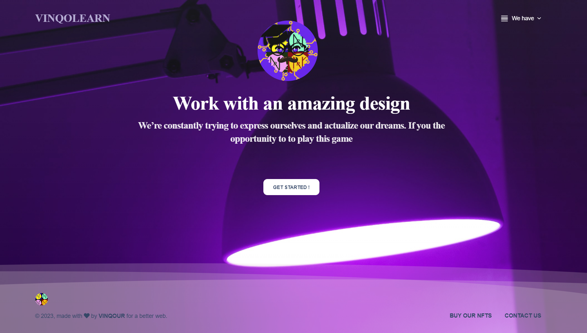
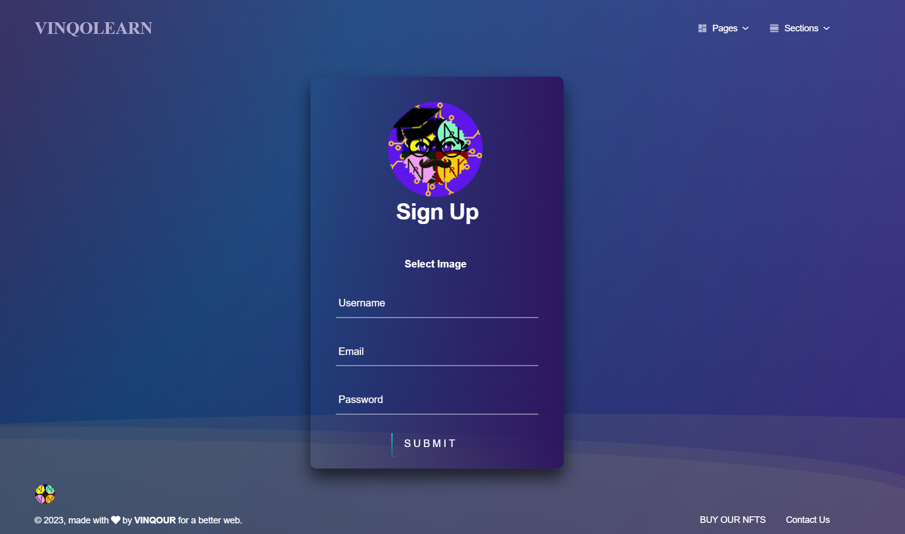
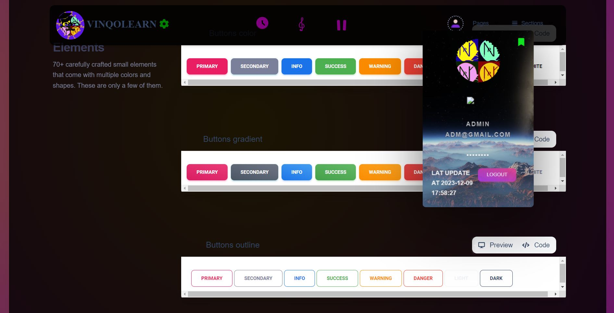
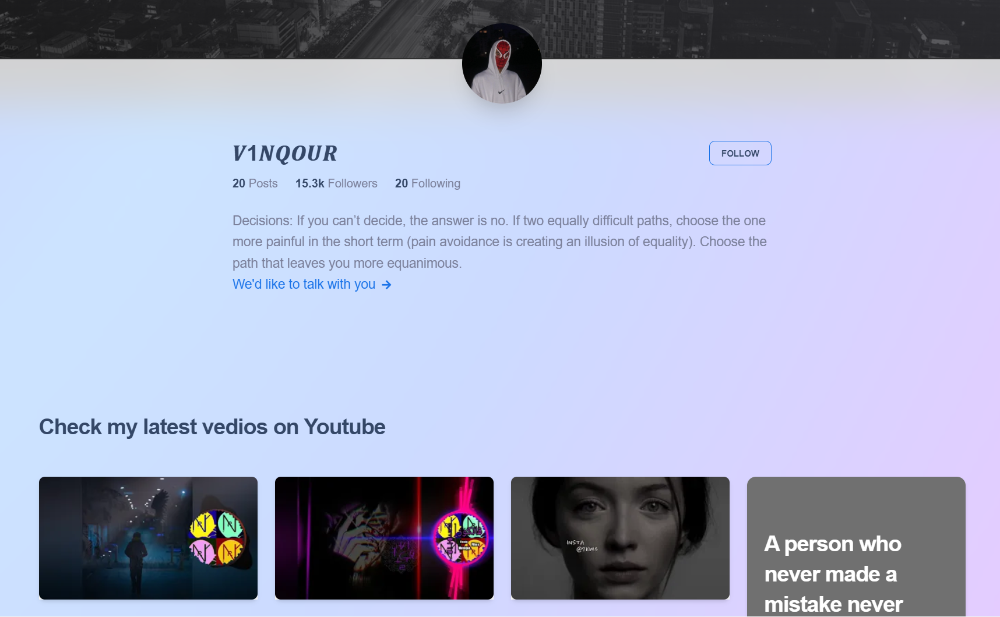
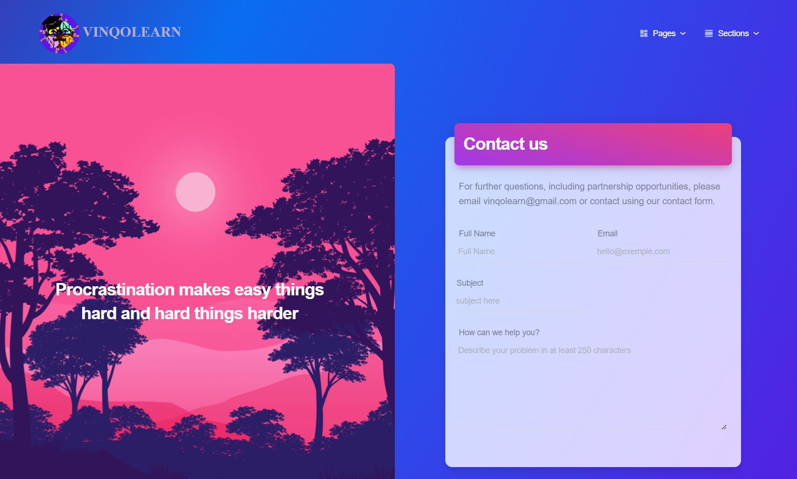
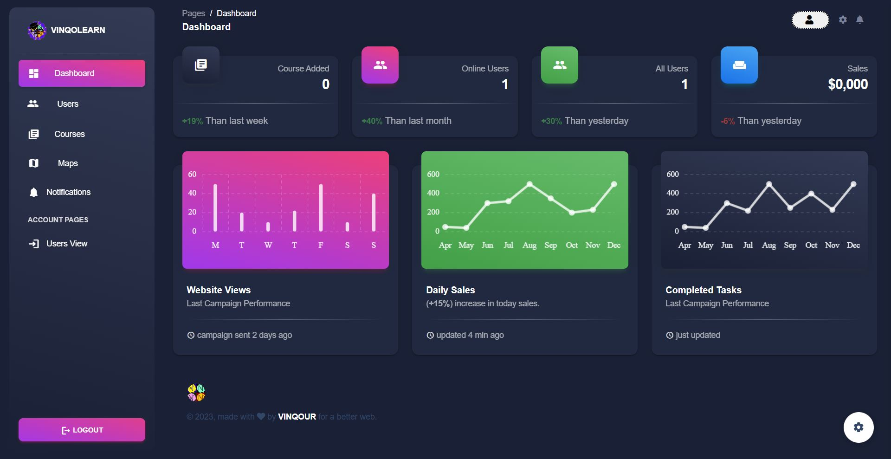
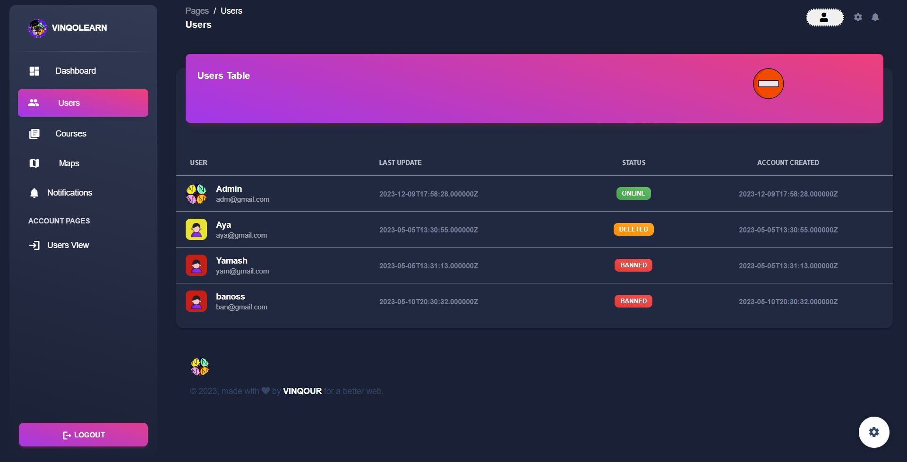

# VINQOLEARN
[]

Welcome to my project! You can find the latest release and release notes in the [Releases](https://github.com/v1nqour/VINQOLEARN/releases) section.

## **Welcome Page:**

## **Sign up Page:**

## **Dashboard Page:**

## **Auther Page:**

## **Contact Us Page:**

## **Admin Pages:**

### To set up a ***Laravel*** project using an alternative method, you can follow these steps:
####  type the following command in the Terminal
`cd laravel` 
#### Copy .env file then fill database fields
`cp .env.example .env` 
#### Install dependencies
`composer install`  
#### If you encounter an error while setting up the composer, try running this comand:
`composer update`  
#### Set the application key
`php artisan key:generate`
#### Migrate the database
`php artisan migrate`
#### Storage link
`php artisan storage:link`
#### serve the project
`php artisan serve`

### To set up a [Vue.js] project using an alternative method, you can follow these steps: :
#### Open the terminal then type the following commands
`cd vue` 
#### Install dependencies
`npm install`  
#### If you encounter an error while setting up the composer, try running this comands:
##### 1:
`npm cache clean --force`
##### 2:
`npm update --force`
##### 3:
`npm update --legacy-peer-deps`
#### Run dev server
`npm run serve`  

### Open This link to display the project:
[Open](http://127.0.0.1:8000/)

## *BY MOUSTAKIR Wassim*
